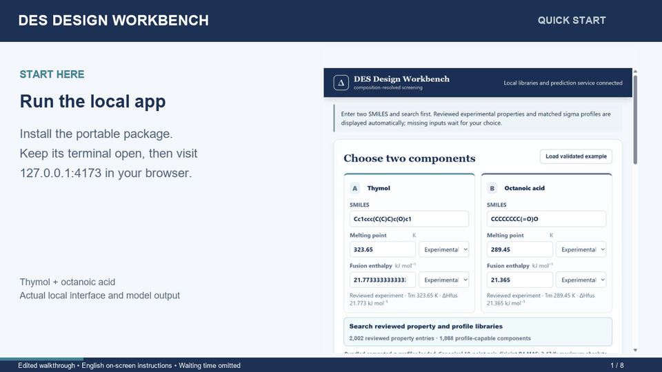

# Quick-start demonstration

[Watch or download the 70-second MP4](https://github.com/WUTing0-0/des-design-workbench/raw/refs/heads/main/docs/media/workbench-demo.mp4)

The video uses actual screenshots from a local research installation running the bundled thymol–octanoic-acid example. On-screen instructions and highlights were added for readability. This is an edited, silent walkthrough, not a continuous screen recording or a measurement of calculation speed. The portable edition runs the same bundled example; its searchable library is smaller than the research library shown here.

## Follow along

1. **00:00 — Start locally.** Follow the [installation instructions](../PORTABLE_README.md). Keep the application terminal open and visit `http://127.0.0.1:4173`.
2. **00:08 — Load the example.** Select **Load validated example**. The example fills the input fields, selects its profiles and runs a calculation automatically.
3. **00:17 — Review the inputs.** Confirm the two structures, melting temperatures, fusion enthalpies and Experimental source labels.
4. **00:26 — Inspect the activity route.** Expand **Activity coefficients and model options**. Library profiles support B4 correction. The ideal `gamma = 1` route supports B3 correction.
5. **00:36 — Recalculate.** After changing inputs or options, select **Calculate composition curve**.
6. **00:44 — Read the curve.** Compare the physical reference and corrected curve. The horizontal axis is component-A mole fraction.
7. **00:53 — Read the support label.** The example's held-out error applies to this pair only. **Not assessed** indicates that an optimized-target prediction interval has not been validated for the current input.
8. **01:02 — Export.** Use **Export curve CSV** for the composition curve and **Export report** for the JSON report.

The displayed minimum (271.7 K near a thymol mole fraction of 0.33) is a model output, not an experimental measurement. It does not establish DES formation or a precise experimental optimum.

For other mixtures, consult the [English user guide](USER_GUIDE.md). Supply measured properties when available and review missing inputs explicitly.
